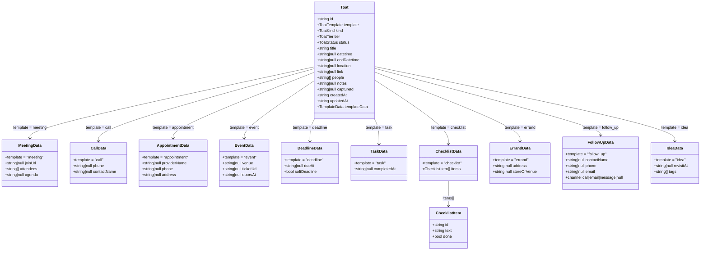

# Toat Type Model

## Enums

| Type | Values |
|---|---|
| `ToatTemplate` | `meeting` `call` `appointment` `event` `deadline` `task` `checklist` `errand` `follow_up` `idea` |
| `ToatKind` | `task` `event` `meeting` `idea` `errand` `deadline` |
| `ToatTier` | `urgent` `important` `regular` |
| `ToatStatus` | `active` `snoozed` `done` `cancelled` `archived` |

## Shared convenience fields on Toat

`location` and `link` live on the base Toat and are populated regardless of template — so a meeting's join URL is also in `link`, and an appointment's address is also in `location`. `templateData` holds the richer template-specific payload.

## Template → Kind mapping

| Template | Kind |
|---|---|
| meeting | meeting |
| call | task |
| appointment | errand |
| event | event |
| deadline | deadline |
| task | task |
| checklist | task |
| errand | errand |
| follow_up | task |
| idea | idea |
